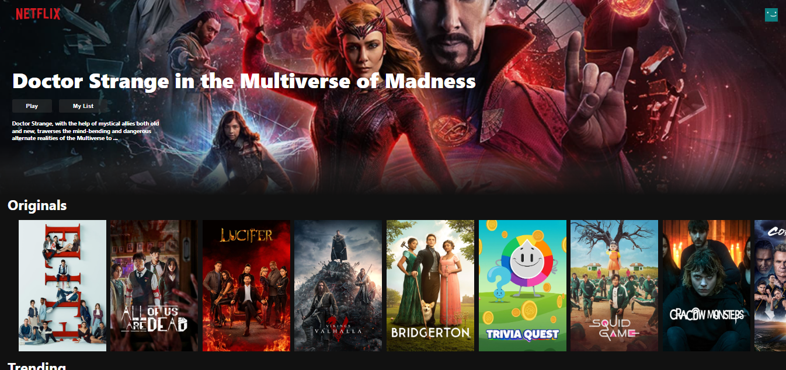

# React Netflix-Clone

Making a netflix ui clone using react.



##Demo

https://netflix-clone-97566.web.app/

## Description

* tmdb movies api is used to fetch movies.
* movies-trailer api help as search the movies trailer from the given movie name
* react-youtube help us play a movie trailer

## Getting Started

### Dependencies

* React
* npm install react-youtube
* npm install movie-trailer

### Installing

* Clone the repo
```
git clone https://github.com/imranzaheer612/react-netflix-clone.git
```

Install movie-trailer package for searching a  movie trailer

```
npm install movie-trailer
```  
Install react-youtube package help playing youtube

```
npm install react-youtube
```  

### Executing program


```
npm start
```


## License

This project is licensed under the [MIT] License - see the LICENSE.md file for details

## Acknowledgments

This tutorial helped allot. You can refer this 
* [Build a NETFLIX Clone with REACT JS](https://www.youtube.com/watch?v=XtMThy8QKqU&t=3648s)